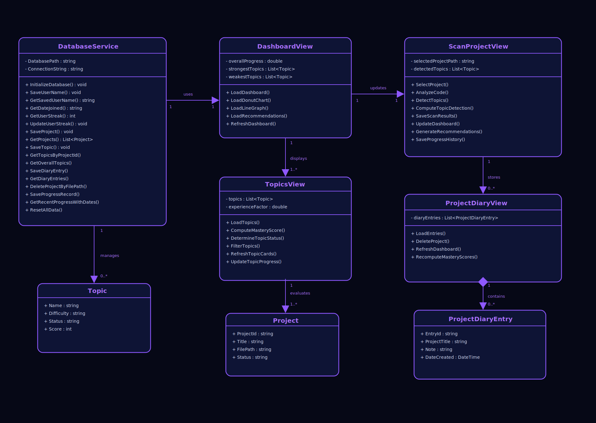

<div align="center">


<br/>

*a system that studies you, studying.*

<br/>

<p align="center">
  
  
  
  
  
</p>

---

<div align="center">


<p align="center">
  
</p>

<p align="center">
  <kbd>📘 Topic Tracking</kbd>&nbsp;
  <kbd>🔍 File Scanning</kbd>&nbsp;
  <kbd>🤖 Recommendation</kbd>&nbsp;
  <kbd>📊 Progress Analytics</kbd>&nbsp;
</p>

</div>
<br>

## 🌟 𝐏𝐑𝐎𝐉𝐄𝐂𝐓 𝐃𝐄𝐒𝐂𝐑𝐈𝐏𝐓𝐈𝐎𝐍

<div align="Left">

ARALyti.cs is an intelligent Study and Project Insight System designed to **analyze C# programming projects** and transform them into meaningful learning insights.

Instead of just storing code, the system *understands it* — identifying programming concepts, tracking skill development, and revealing how a developer is growing over time.

It serves as a personal learning companion that bridges the gap between **writing code** and **mastering it**.

</div>

## 🎯𝐏𝐔𝐑𝐏𝐎𝐒𝐄

<div align="Left">

The purpose of ARALyti.cs is to empower programmers to take control of their learning journey by turning real projects into actionable insights.

Through intelligent analysis, the system:
- 🔍 Identifies programming concepts used in C# projects  
- 📊 Tracks progress across different topics and skills  
- 🧠 Understands learning patterns over time  
- 🚀 Recommends what to learn next for continuous improvement  

Therefore, ARALyti.cs transforms coding practice into a **guided learning experience**, helping developers grow smarter with every project they build.

</div>

<br>

<div align="center">

## 🧩 𝐔𝐌𝐋 𝐃𝐈𝐀𝐆𝐑𝐀𝐌

</div>




<br>


<div align="center">

## 🗂️ 𝐅𝐄𝐀𝐓𝐔𝐑𝐄𝐒 & 𝐅𝐔𝐍𝐂𝐓𝐈𝐎𝐍𝐀𝐋𝐈𝐓𝐈𝐄𝐒

| Feature | Functionality |
|--------|------------|
| 📘 **Programming Topic Analysis** | Analyze detected C# programming topics and compute mastery scores based on scanned projects |
| 🔍 **C# File Scanner** | Scan uploaded `.cs` files and detect programming concepts such as OOP, Classes, Loops, Arrays, and Methods |
| 🤖 **Recommendation System** | Suggest weak or unexplored programming topics based on overall mastery scores and detected progress |
| 📝 **Project Diary** | Store project reflections and learning notes linked to scanned projects |
| 📊 **Progress Analytics Dashboard** | Visualize overall programming mastery using donut charts, line graphs, topic rankings, and progress history |
| 👤 **Persistent User Profile** | Save user profile data including username, streak, and account creation date locally using SQLite |


<br>

<div align="center">

### ✦ ⋆ ˚｡ **The Stack Behind It** ˚｡ ⋆ ✦

</div>

<table align="center">
<tr>

<td align="center" width="25%">

<br><b>C# + WPF</b>
<br><sub>Desktop application built using<br>Object-Oriented Programming principles</sub>
</td>

<td align="center" width="25%">

<br><b>LiveCharts2</b>
<br><sub>Interactive donut charts and<br>progress visualization analytics</sub>
</td>

<td align="center" width="25%">

<br><b>Roslyn Analyzer</b>
<br><sub>Syntax-based topic detection<br>for C# programming concepts</sub>
</td>

<td align="center" width="25%">

<br><b>SQLite Database</b>
<br><sub>Persistent local storage for<br>projects, topics, and diary entries</sub>
</td>

</tr>
</table>

<br><br>

<div align="center">

## 🖥️ 𝐒𝐘𝐒𝐓𝐄𝐌 𝐏𝐑𝐄𝐕𝐈𝐄𝐖

> — *the system in action* —


| DASHBOARD | SCAN PROJECT |
|:---:|:---:|
|  |  |
| *Skill overview + topic progress chart* | *Upload `.cs` file + detect concepts* |

| TOPICS VIEW | PROJECT DIARY |
|:---:|:---:|
|  |  |
| *Scores, classification, and status per topic* | *Timestamped notes and reflections* |

<br>


<div align="center">

## ⚙️ 𝐇𝐎𝐖 𝐈𝐓 𝐖𝐎𝐑𝐊𝐒

</div>


<br>


## 🚀 𝐆𝐄𝐓𝐓𝐈𝐍𝐆 𝐒𝐓𝐀𝐑𝐓𝐄𝐃

<div align="left">

### Prerequisites
- Visual Studio 2022 or higher
- .NET 6 or higher
- LiveCharts2 *(auto-restored via NuGet — no manual install needed)*

### Installation & Running

**1. Clone the repository:**
```bash
git clone https://github.com/Kirstnnlx/ARALyti.cs
cd ARALyti.cs
```

**2. Open in Visual Studio:**
```
File → Open → Project/Solution → ARALyti.cs.sln
```

**3. Restore NuGet packages:**
```
Right-click Solution → Restore NuGet Packages
```

**4. Run the app:**
```
Press F5  —or—  click the ▶ Start button
```

<br>


<div align="center">


<div align="center">

## 𝐌𝐄𝐄𝐓 𝐓𝐇𝐄 𝐓𝐄𝐀𝐌

TO FOLLOW ITO

</div>


<br>

<div align="center">


<br>


<br>

*© 2026 ARALyti.cs. Built for AOOP.*  
*ARALyti.cs is a project created for educational purposes.*

</div>


