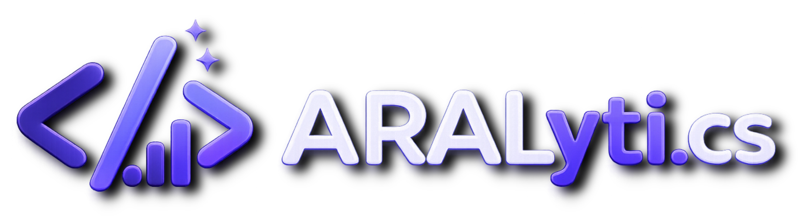
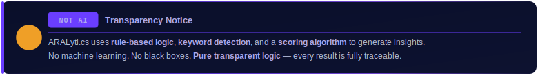
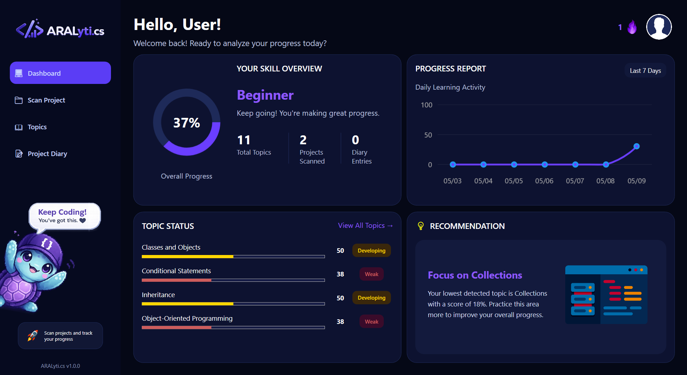
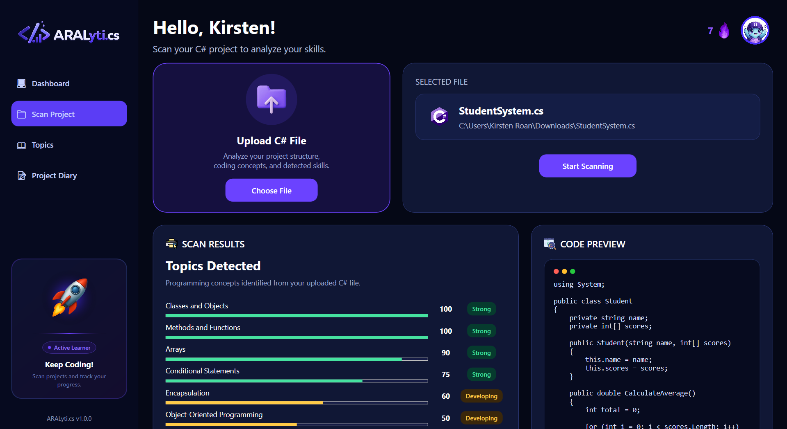
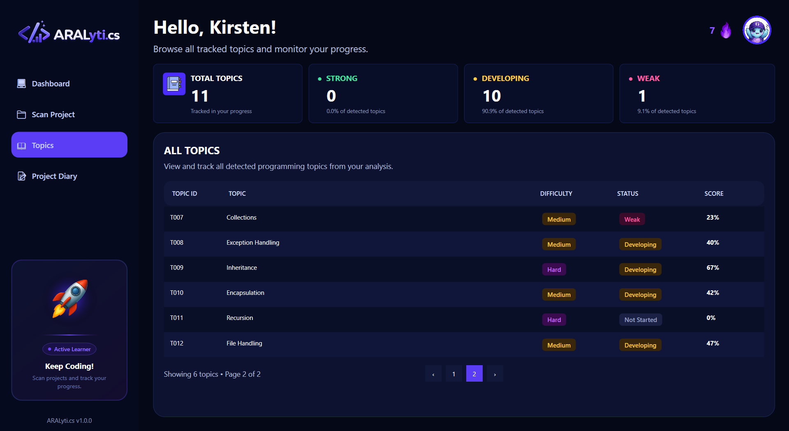
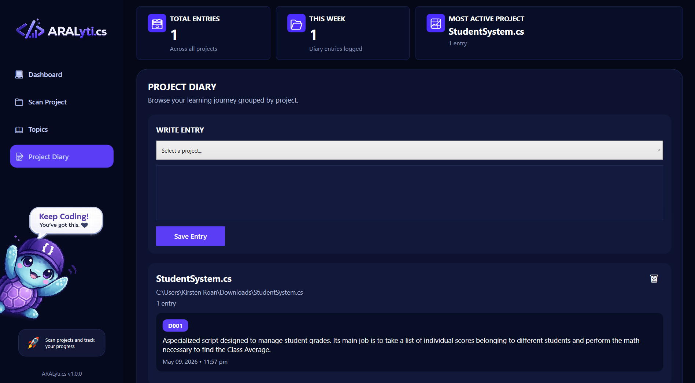
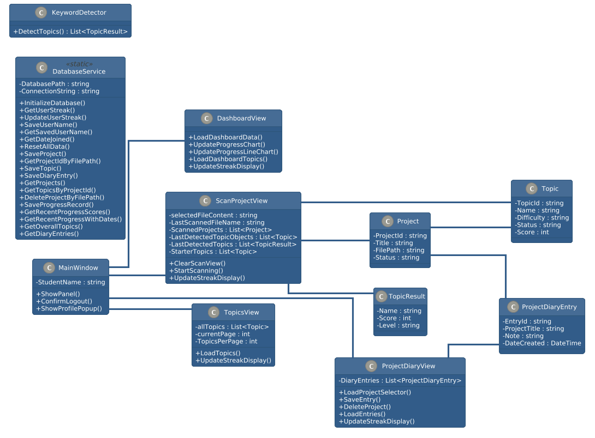
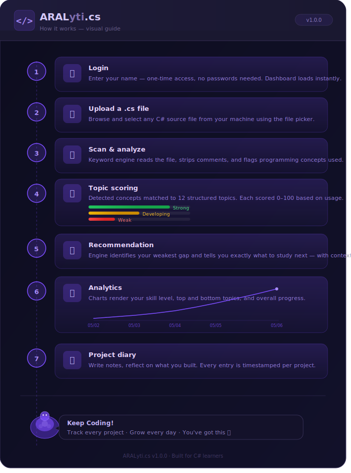
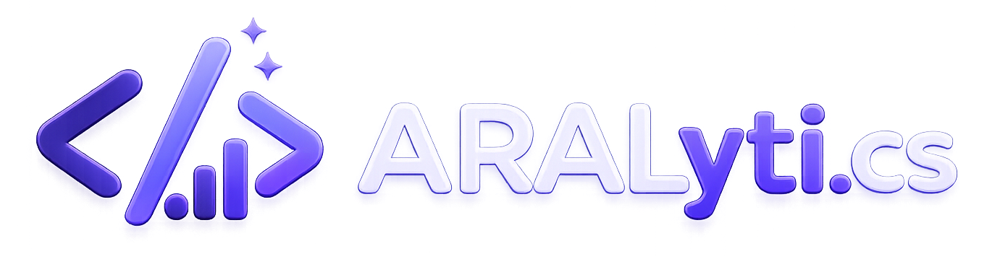

<div align="center">



<br>

*— a system that studies you, studying —*

<br>

<p>
  
  
  
  
  
</p>

<br>




<kbd>📘 Topic Tracking</kbd>&nbsp;
<kbd>🔍 File Scanning</kbd>&nbsp;
<kbd>🤖 Recommendation</kbd>&nbsp;
<kbd>📊 Progress Analytics</kbd>

</div>

<br>

<div align="center">

## 🌟 𝐏𝐑𝐎𝐉𝐄𝐂𝐓 𝐃𝐄𝐒𝐂𝐑𝐈𝐏𝐓𝐈𝐎𝐍

</div>

**ARALyti.cs** is a Study and Project Insight System designed to analyze C# programming projects and transform them into meaningful learning insights.

Instead of simply storing code, the system studies the project, identifies programming concepts, tracks skill development, and reveals how a developer grows over time.

It serves as a personal learning companion that bridges the gap between **writing code** and **mastering it**.

<br>

<div align="center">

## 🎯 𝐏𝐔𝐑𝐏𝐎𝐒𝐄

</div>

The purpose of **ARALyti.cs** is to help programmers take control of their learning journey by turning real C# projects into actionable insights.

Through intelligent analysis, the system can:

- 🔍 Identify programming concepts used in C# projects
- 📊 Track progress across topics and skills
- 🧠 Recognize learning patterns over time
- 🚀 Recommend what to improve next

Therefore, ARALyti.cs transforms coding practice into a **guided learning experience**, helping developers grow smarter with every project they build.

<br>

<div align="center">

## 🗂️ 𝐅𝐄𝐀𝐓𝐔𝐑𝐄𝐒 & 𝐅𝐔𝐍𝐂𝐓𝐈𝐎𝐍𝐀𝐋𝐈𝐓𝐈𝐄𝐒

</div>

| Feature | Functionality |
|---|---|
| 📘 **Programming Topic Analysis** | Analyzes detected C# programming topics and computes mastery scores based on scanned projects |
| 🔍 **C# File Scanner** | Scans uploaded `.cs` files and detects programming concepts such as OOP, Classes, Loops, Arrays, and Methods |
| 🤖 **Recommendation System** | Suggests weak programming topics based on mastery scores and detected progress |
| 📝 **Project Diary** | Stores project reflections and learning notes linked to scanned projects |
| 📊 **Progress Analytics Dashboard** | Visualizes overall programming mastery using donut charts, line graphs, topic rankings, and progress history |
| 👤 **Persistent User Profile** | Saves username, streak, and account creation date locally using SQLite |

<br>

<div align="center">

## ✦ ⋆ ˚｡ 𝐓𝐇𝐄 𝐒𝐓𝐀𝐂𝐊 𝐁𝐄𝐇𝐈𝐍𝐃 𝐈𝐓 ˚｡ ⋆ ✦

</div>

<table align="center">
<tr>

<td align="center" width="25%">

<br><b>C# + WPF</b>
<br><sub>Desktop application built using<br>Object-Oriented Programming principles</sub>
</td>

<td align="center" width="25%">

<br><b>LiveCharts2</b>
<br><sub>Interactive donut charts and<br>progress visualization analytics</sub>
</td>

<td align="center" width="25%">

<br><b>Roslyn Analyzer</b>
<br><sub>Syntax-based topic detection<br>for C# programming concepts</sub>
</td>

<td align="center" width="25%">

<br><b>SQLite Database</b>
<br><sub>Persistent local storage for<br>projects, topics, and diary entries</sub>
</td>

</tr>
</table>

<br>

<div align="center">

## 🖥️ 𝐒𝐘𝐒𝐓𝐄𝐌 𝐏𝐑𝐄𝐕𝐈𝐄𝐖

> — *the system in action* —

</div>


<table width="100%">
<tr>
<td align="center">

### 📊 DASHBOARD



</td>
</tr>

<tr>
<td align="center" bgcolor="#161B22">


*Skill overview + topic progress chart*


</td>
</tr>
</table>

<br>

<table width="100%">
<tr>
<td align="center">

### 📂 SCAN PROJECT



</td>
</tr>

<tr>
<td align="center" bgcolor="#161B22">


*Upload `.cs` file + detect concepts*


</td>
</tr>
</table>

<br>

<table width="100%">
<tr>
<td align="center">

### 📚 TOPICS VIEW



</td>
</tr>

<tr>
<td align="center" bgcolor="#161B22">


*Scores, classification, and status per topic*


</td>
</tr>
</table>

<br>

<table width="100%">
<tr>
<td align="center">

### 📝 PROJECT DIARY



</td>
</tr>

<tr>
<td align="center" bgcolor="#161B22">


*Timestamped notes and reflections*

</td>
</tr>
</table>

<br>

<div align="center">

## 🧩 𝐔𝐌𝐋 𝐃𝐈𝐀𝐆𝐑𝐀𝐌

</div>



<br><br>

<div align="center">

## ⚙️ 𝐇𝐎𝐖 𝐈𝐓 𝐖𝐎𝐑𝐊𝐒

</div>



<br><br>

<div align="center">

## 👩🏻‍💻 𝐎𝐁𝐉𝐄𝐂𝐓-𝐎𝐑𝐈𝐄𝐍𝐓𝐄𝐃 𝐏𝐑𝐈𝐍𝐂𝐈𝐏𝐋𝐄𝐒

</div>

<table>
<tr>
<td width="100%" align="center">


</td>
</tr>
<tr>
<td>

Encapsulation is implemented by keeping sensitive data and implementation details private, exposing only safe public methods. In **`DatabaseService`**, the SQLite connection string is private static, so other classes cannot directly alter it. All database operations must go through public static methods like **`SaveProject()`**, ensuring controlled access to stored data.

Similarly, **`ScanProjectView`** hides uploaded file content in a private field, preventing accidental external modification.

<br>

<details>
<summary><b>📄 Code Example</b></summary>

<br>

```csharp
public static class DatabaseService
{
    private static readonly string ConnectionString = "Data Source=aralytics.db";

    public static void SaveProject(string title, string filePath)
    {
        using var connection = new SqliteConnection(ConnectionString);

        connection.Open();

        // validation and save logic
    }
}
```

</details>

</td>
</tr>
</table>

<br>

<table>
<tr>
<td width="100%" align="center">


</td>
</tr>
<tr>
<td>

Inheritance is used to reuse and extend existing functionality without rewriting code. **`TopicCollector`** inherits from **`CSharpSyntaxWalker`**, a Roslyn class, gaining the ability to traverse C# syntax trees automatically.

It overrides specific methods to inject custom topic detection logic while preserving the base syntax-walking behavior. The system views such as **`DashboardView`**, **`ScanProjectView`**, **`TopicsView`**, and **`ProjectDiaryView`** also inherit from **`UserControl`**, reusing WPF interface capabilities while adding their own features.

<br>

<details>
<summary><b>📄 Code Example</b></summary>

<br>

```csharp
internal class TopicCollector : CSharpSyntaxWalker
{
    public override void VisitClassDeclaration(ClassDeclarationSyntax node)
    {
        Add("Classes and Objects", 40);

        base.VisitClassDeclaration(node);
    }
}
```

</details>

</td>
</tr>
</table>

<br>

<table>
<tr>
<td width="100%" align="center">


</td>
</tr>
<tr>
<td>

Polymorphism allows similar method patterns to behave differently depending on the object or context. In **`TopicCollector`**, multiple overridden `VisitXxx` methods are called depending on the syntax node type being analyzed.

For example, `VisitClassDeclaration()` detects classes, `VisitIfStatement()` detects conditional statements, and `VisitTryStatement()` detects exception handling. Roslyn automatically calls the appropriate override, allowing the system to process different code structures cleanly.

<br>

<details>
<summary><b>📄 Code Example</b></summary>

<br>

```csharp
public override void VisitClassDeclaration(ClassDeclarationSyntax node)
{
    Add("Classes and Objects", 40);

    base.VisitClassDeclaration(node);
}

public override void VisitIfStatement(IfStatementSyntax node)
{
    Add("Conditional Statements", 30);

    base.VisitIfStatement(node);
}

public override void VisitTryStatement(TryStatementSyntax node)
{
    Add("Exception Handling", 25);

    base.VisitTryStatement(node);
}
```

</details>

</td>
</tr>
</table>

<br>

<table>
<tr>
<td width="100%" align="center">


</td>
</tr>
<tr>
<td>

Abstraction hides complex internal details behind simple public methods. The **`KeywordDetector`** exposes **`DetectTopics(string code)`**, which returns a clean list of **`TopicResult`** objects.

The caller does not need to handle Roslyn parsing, syntax tree traversal, or scoring logic directly. Similarly, **`DatabaseService`** provides simple methods like **`SaveProject()`**, **`GetProjects()`**, and **`GetOverallTopics()`**, hiding SQL connection and command details.

<br>

<details>
<summary><b>📄 Code Example</b></summary>

<br>

```csharp
public class KeywordDetector
{
    public List<TopicResult> DetectTopics(string code)
    {
        var tree = CSharpSyntaxTree.ParseText(code);

        var collector = new TopicCollector();

        collector.Visit(tree.GetRoot());

        return collector.GetResults();
    }
}
```

</details>

</td>
</tr>
</table>

<br>

<div align="center">

## 🚀 𝐆𝐄𝐓𝐓𝐈𝐍𝐆 𝐒𝐓𝐀𝐑𝐓𝐄𝐃

</div>

<div align="left">

### Prerequisites

- Visual Studio 2022 or higher
- .NET 6 or higher
- LiveCharts2 *(auto-restored via NuGet — no manual installation needed)*

### Installation & Running

**1. Clone the repository**

```bash
git clone https://github.com/Kirstnnlx/ARALyti.cs
cd ARALyti.cs
```

**2. Open in Visual Studio**

```text
File → Open → Project/Solution → ARALyti.cs.sln
```

**3. Restore NuGet packages**

```text
Right-click Solution → Restore NuGet Packages
```

**4. Run the application**

```text
Press F5 —or— click the ▶ Start button
```

</div>

<br>

<div align="center">

## 𝐌𝐄𝐄𝐓 𝐓𝐇𝐄 𝐓𝐄𝐀𝐌

</div>

<table>
<tr>

<td align="center" width="33%">


━━━━━━━━━━━


<b>DE GRACIA, NIELA ALENA V.</b>


<i>GUI Developer</i>

</td>

<td align="center" width="33%">


━━━━━━━━━━━


<b>DUMLAO, KIRSTEN ROAN A.</b>


<i>Project Manager &<br>Lead Developer</i>

</td>

<td align="center" width="33%">


<br>

━━━━━━━━━━━


<b>NCINAS, MARK JOHN LLOYD L.</b>


<i>Logic Developer</i>

</td>

</tr>
</table>

<br>

<div align="center">

### 🫶🏻 𝐀𝐂𝐊𝐍𝐎𝐖𝐋𝐄𝐃𝐆𝐄𝐌𝐄𝐍𝐓

</div>

<div align="left">


We would like to express our sincere gratitude to **Ms. Darlene Opeña** for her guidance, patience, support, and valuable feedback throughout the development of ARALyti.cs. Her teachings and encouragement helped us improve both our system and our skills as student developers.

We would also like to thank every member of the **ARALyti.cs team** for the teamwork, effort, creativity, and late-night debugging sessions that made this project possible. Every contribution played an important role in building and improving the system.

Lastly, we would like to thank every scanned **.cs file** that humbled us along the way. Every syntax error, failed build, unexpected output, and debugging struggle became part of our learning experience and helped us better understand programming concepts while developing this project.

</div>

<br>

<div align="center">



<br>


<br>

*© 2026 ARALyti.cs. Built for AOOP.*

</div>